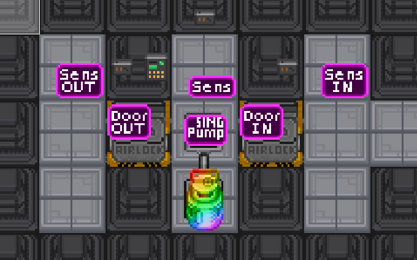

## Airlocks and You
###### The cumulation of my hatred for TG magic locks.

So, you want an airlock? Fuck you. You have to manually set a bunch of vars, unless you're happy with the compromise of magic airlocks, neither of which can be rebuilt. Ew.

Anyways, so here's how the new system works:

1. Place down two doors in a hallway/either side of a room. 
2. **Make sure the airlock doesn't share an area with another.**
	1. Unless you're willing to make subtypes of the mapping helpers and controller for the airlocks that share areas.
3. Place down the airlock controller. See code comments on which type to use, but generally you want the autoset ones.
4. Place down an air sensor inside the airlock room.
	1. You can add an exterior and interior air sensor on either side of the airlock, for viewing the interior and exterior pressures. Recommended for hallway airlocks, and on airlock interiors, though not a must-have.
5. Place down either a dual port ventpump, a single port ventpump, or airlock ventpump.
	1. Use the simple mapping helper for the single port or airlock ventpumps.
	2. Be aware that a single port ventpump is likely to gather up contaminants over use, especially if a gas leak or fire occurrs. Airlock ventpumps don't suffer this issue, but slowly release contaminants back into the interior over time.
6. Place down the mapping helpers for the airlock doors, the pump (as described above), and any sensors you've added.
7. Load into the game, and witness the easiest fucking airlocks to ever exist.

**Don't use magiclocks unless you have to.**

